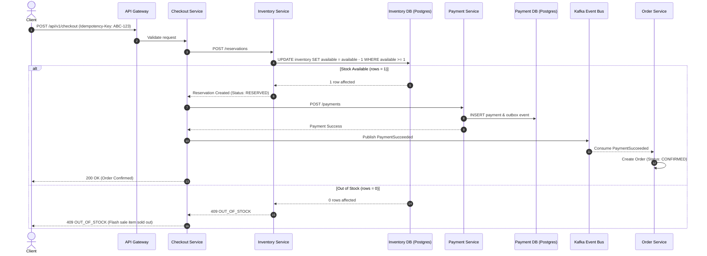
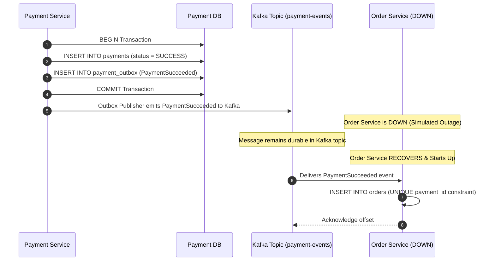

# SALESTORM Sequence Diagrams

## 1. Flash-Sale Purchase & Reservation Sequence

```mermaid
sequenceDiagram
    autonumber
    actor Client
    participant Gateway as API Gateway
    participant Checkout as Checkout Service
    participant Inventory as Inventory Service
    participant InventoryDB as Inventory DB (Postgres)
    participant Payment as Payment Service
    participant PaymentDB as Payment DB (Postgres)
    participant Kafka as Kafka Event Bus
    participant Order as Order Service

    Client->>Gateway: POST /api/v1/checkout (Idempotency-Key: ABC-123)
    Gateway->>Checkout: Validate request
    Checkout->>Inventory: POST /reservations
    Inventory->>InventoryDB: UPDATE inventory SET available = available - 1 WHERE available >= 1
    alt Stock Available (rows = 1)
        InventoryDB-->>Inventory: 1 row affected
        Inventory-->>Checkout: Reservation Created (Status: RESERVED)
        Checkout->>Payment: POST /payments
        Payment->>PaymentDB: INSERT payment & outbox event
        Payment-->>Checkout: Payment Success
        Checkout->>Kafka: Publish PaymentSucceeded
        Kafka-->>Order: Consume PaymentSucceeded
        Order->>Order: Create Order (Status: CONFIRMED)
        Checkout-->>Client: 200 OK (Order Confirmed)
    else Out of Stock (rows = 0)
        InventoryDB-->>Inventory: 0 rows affected
        Inventory-->>Checkout: 409 OUT_OF_STOCK
        Checkout-->>Client: 409 OUT_OF_STOCK (Flash sale item sold out)
    end
```

## 2. Payment Success + Order Service Outage Recovery Sequence

```mermaid
sequenceDiagram
    autonumber
    participant Payment as Payment Service
    participant PaymentDB as Payment DB
    participant Kafka as Kafka Topic (payment-events)
    participant Order as Order Service (DOWN)

    Payment->>PaymentDB: BEGIN Transaction
    Payment->>PaymentDB: INSERT INTO payments (status = SUCCESS)
    Payment->>PaymentDB: INSERT INTO payment_outbox (PaymentSucceeded)
    Payment->>PaymentDB: COMMIT Transaction
    
    Payment->>Kafka: Outbox Publisher emits PaymentSucceeded to Kafka
    Note over Order: Order Service is DOWN (Simulated Outage)
    Note over Kafka: Message remains durable in Kafka topic
    
    Note over Order: Order Service RECOVERS & Starts Up
    Kafka->>Order: Delivers PaymentSucceeded event
    Order->>Order: INSERT INTO orders (UNIQUE payment_id constraint)
    Order-->>Kafka: Acknowledge offset
```
