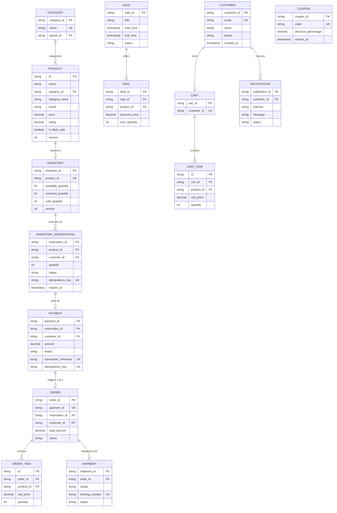

# SALESTORM Database Entity Relationship Diagram (ERD)

```mermaid
erDiagram
    CUSTOMER {
        string customer_id PK
        string email UK
        string name
        string phone
        timestamp created_at
    }

    CATEGORY {
        string category_id PK
        string name UK
        string parent_id FK
    }

    PRODUCT {
        string id PK
        string name
        string category_id FK
        string category_name
        string brand
        decimal price
        decimal rating
        boolean is_flash_sale
        int version
    }

    SALE {
        string sale_id PK
        string title
        timestamp start_time
        timestamp end_time
        string status
    }

    DEAL {
        string deal_id PK
        string sale_id FK
        string product_id FK
        decimal discount_price
        int max_quantity
    }

    COUPON {
        string coupon_id PK
        string code UK
        decimal discount_percentage
        timestamp expires_at
    }

    INVENTORY {
        string inventory_id PK
        string product_id UK
        int available_quantity
        int reserved_quantity
        int sold_quantity
        int version
    }

    INVENTORY_RESERVATION {
        string reservation_id PK
        string product_id FK
        string customer_id FK
        int quantity
        string status
        string idempotency_key UK
        timestamp expires_at
    }

    CART {
        string cart_id PK
        string customer_id UK
    }

    CART_ITEM {
        string id PK
        string cart_id FK
        string product_id FK
        decimal unit_price
        int quantity
    }

    PAYMENT {
        string payment_id PK
        string reservation_id FK
        string customer_id FK
        decimal amount
        string status
        string transaction_reference UK
        string idempotency_key UK
    }

    ORDER {
        string order_id PK
        string payment_id UK
        string reservation_id FK
        string customer_id FK
        decimal total_amount
        string status
    }

    ORDER_ITEM {
        string id PK
        string order_id FK
        string product_id FK
        decimal unit_price
        int quantity
    }

    SHIPMENT {
        string shipment_id PK
        string order_id FK
        string carrier
        string tracking_number UK
        string status
    }

    NOTIFICATION {
        string notification_id PK
        string customer_id FK
        string channel
        string message
        string status
    }

    CUSTOMER ||--o| CART : "owns"
    CART ||--|{ CART_ITEM : "contains"
    CATEGORY ||--o{ PRODUCT : "categorizes"
    PRODUCT ||--o| INVENTORY : "tracked in"
    INVENTORY ||--o{ INVENTORY_RESERVATION : "reserved via"
    INVENTORY_RESERVATION ||--o| PAYMENT : "paid via"
    PAYMENT ||--o| ORDER : "triggers 1-to-1"
    ORDER ||--|{ ORDER_ITEM : "contains"
    ORDER ||--o| SHIPMENT : "dispatched via"
    CUSTOMER ||--o{ NOTIFICATION : "receives"
    SALE ||--|{ DEAL : "offers"
```
