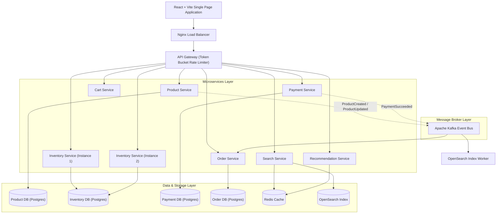

# SALESTORM Container / Service Diagram (C4 Level 2)

```mermaid
graph TD
    Client["React + Vite Single Page Application"]
    LB["Nginx Load Balancer"]
    GW["API Gateway (Token Bucket Rate Limiter)"]

    Client --> LB --> GW

    subgraph Microservices Layer
        ProductSvc["Product Service"]
        SearchSvc["Search Service"]
        CartSvc["Cart Service"]
        InventorySvc1["Inventory Service (Instance 1)"]
        InventorySvc2["Inventory Service (Instance 2)"]
        PaymentSvc["Payment Service"]
        OrderSvc["Order Service"]
        RecSvc["Recommendation Service"]
    end

    GW --> ProductSvc
    GW --> SearchSvc
    GW --> CartSvc
    GW --> InventorySvc1
    GW --> InventorySvc2
    GW --> PaymentSvc
    GW --> OrderSvc
    GW --> RecSvc

    subgraph Data & Storage Layer
        ProductDB[("Product DB (Postgres)")]
        InventoryDB[("Inventory DB (Postgres)")]
        PaymentDB[("Payment DB (Postgres)")]
        OrderDB[("Order DB (Postgres)")]
        RedisCache[("Redis Cache")]
        OpenSearch[("OpenSearch Index")]
    end

    ProductSvc --> ProductDB
    InventorySvc1 --> InventoryDB
    InventorySvc2 --> InventoryDB
    PaymentSvc --> PaymentDB
    OrderSvc --> OrderDB

    SearchSvc --> RedisCache
    SearchSvc --> OpenSearch
    RecSvc --> RedisCache

    subgraph Message Broker Layer
        Kafka["Apache Kafka Event Bus"]
    end

    ProductSvc -. "ProductCreated / ProductUpdated" .-> Kafka
    PaymentSvc -. "PaymentSucceeded" .-> Kafka
    Kafka --> OrderSvc
    Kafka --> OpenSearchWorker["OpenSearch Index Worker"]
```
