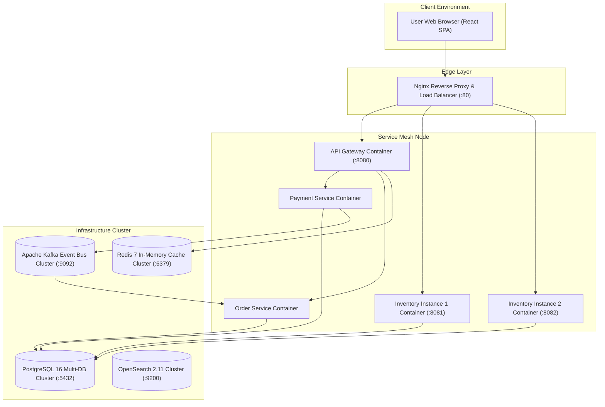

# SALESTORM Deployment Diagram

```mermaid
graph TD
    subgraph Client Environment
        Browser["User Web Browser (React SPA)"]
    end

    subgraph Edge Layer
        Nginx["Nginx Reverse Proxy & Load Balancer (:80)"]
    end

    subgraph Service Mesh Node
        GatewayNode["API Gateway Container (:8080)"]
        InvNode1["Inventory Instance 1 Container (:8081)"]
        InvNode2["Inventory Instance 2 Container (:8082)"]
        PayNode["Payment Service Container"]
        OrderNode["Order Service Container"]
    end

    subgraph Infrastructure Cluster
        PostgresNode[("PostgreSQL 16 Multi-DB Cluster (:5432)")]
        RedisNode[("Redis 7 In-Memory Cache Cluster (:6379)")]
        KafkaNode[("Apache Kafka Event Bus Cluster (:9092)")]
        OpenSearchNode[("OpenSearch 2.11 Cluster (:9200)")]
    end

    Browser --> Nginx
    Nginx --> GatewayNode
    Nginx --> InvNode1
    Nginx --> InvNode2

    GatewayNode --> PayNode
    GatewayNode --> OrderNode

    InvNode1 --> PostgresNode
    InvNode2 --> PostgresNode
    PayNode --> PostgresNode
    OrderNode --> PostgresNode

    PayNode --> KafkaNode
    KafkaNode --> OrderNode
    GatewayNode --> RedisNode
```
